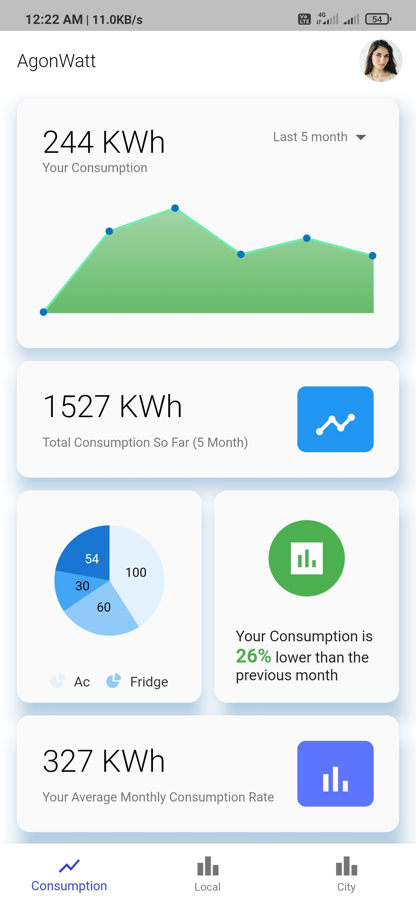
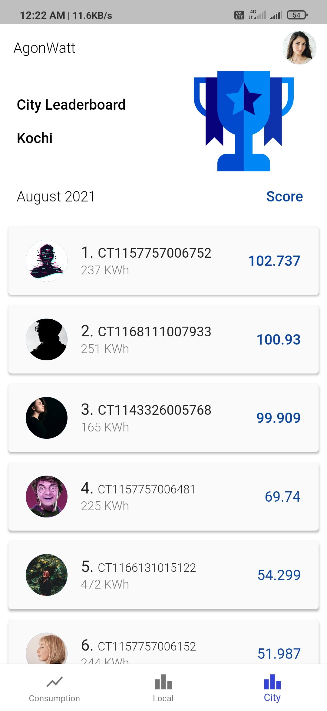
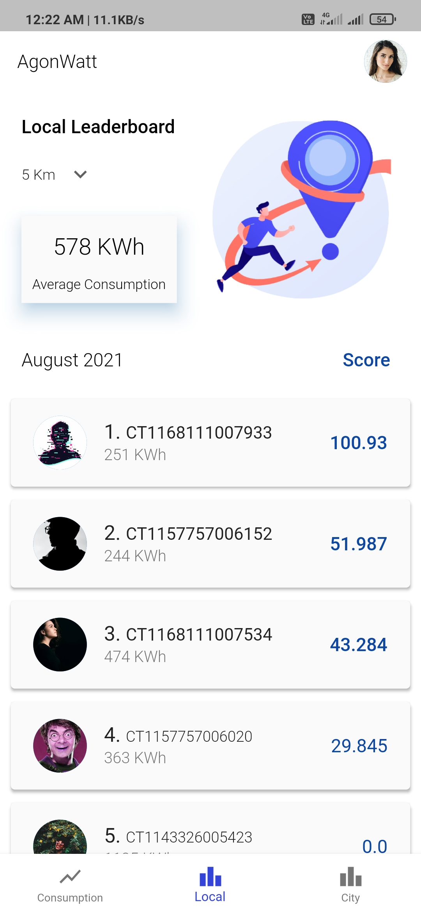
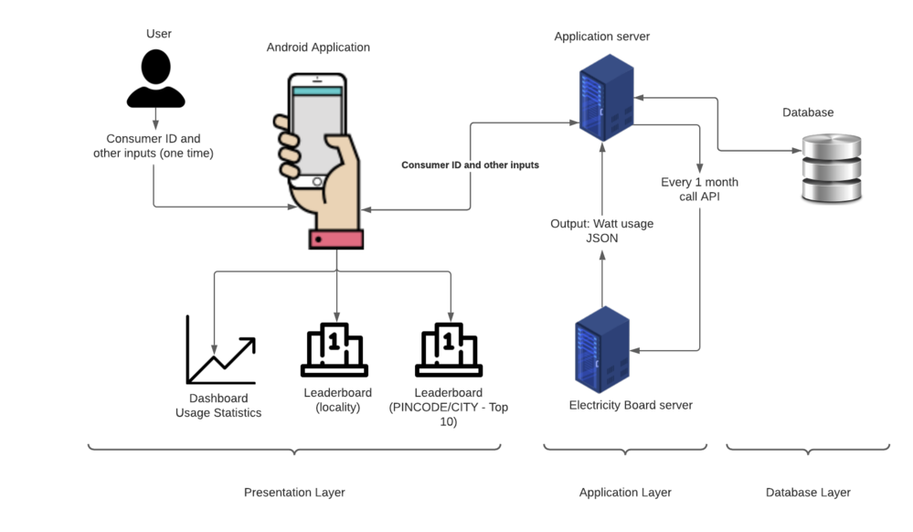

# AgonWatt
Mobile Application that aims to reduce carbon footprint by incentivizing lesser electricity consumption.
```
Theme: Sustainable Developement for better tomorrow
```
&nbsp;&nbsp;&nbsp;&nbsp;&nbsp;&nbsp;&nbsp;&nbsp;&nbsp;&nbsp;&nbsp;&nbsp;
&nbsp;&nbsp;&nbsp;&nbsp;&nbsp;&nbsp;&nbsp;&nbsp;&nbsp;&nbsp;&nbsp;
&nbsp;&nbsp;&nbsp;&nbsp;&nbsp;&nbsp;&nbsp;&nbsp;&nbsp;&nbsp;&nbsp;


## Problem Statement
Globally, the primary source of greenhouse gas emissions is electricity and heat that accounts for 31% of total consumption. If left unchecked, this would further deteriorate the condition and pose an existential threat to every organism in the planet. Our objective is to create an application that can help people reduce their carbon footprint and do their part to combat climate change.

## Personas of System
End user consists of people who wish to reduce their energy bills and inturn their carbon footprints.

## Architecture



Three level Architecture:
1. Presentation layer - The layer that interfaces the user to the application server. This layer consists of all the screens including the dashboard and the 2 leaderboards. 
2. Application layer - This layer consists of the application server and the electricity board server. The application server is responsible for all handling all API call from the mobile app. The electricity board server provides with the electricity unit consumption of a user, specified by the consumer ID, for 'n' months.
3. Database layer - This layer houses the database for the application.

## Demonstration 
Video link: https://drive.google.com/file/d/1K32WE-cs1gbEULzFLo2kArO8d4t2_dUo/view?usp=sharing

## Presentation
Presentation link: https://www.canva.com/design/DAErUX7hOZc/isIkkl56ZkRBb5RZ0NcdKg/view?utm_content=DAErUX7hOZc&utm_campaign=designshare&utm_medium=link&utm_source=publishsharelink

## List of Contributors
- Abhishek Seth (Mentor)
- Sanket Gandhare (Mentor)
- Anjaly Sajeevkumar - Dataset creation
- Anjana P Saji - Dataset creation
- Krishnanand V P - App Developement
- Navaneeth D - Presentaion/Video
- Shuaib Abubakker - App Developement/Video
- Soorya K - Dataset creation
- Ziyad Onji - App Developement
