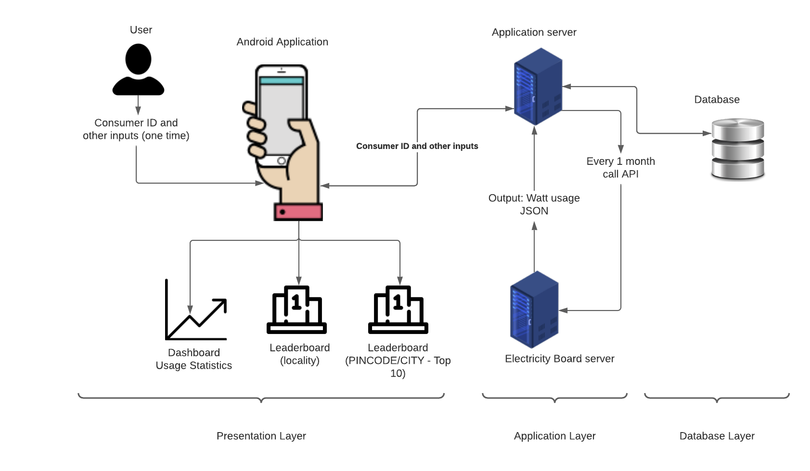

# AgonWatt
Mobile Application that aims to reduce carbon footprint by incentivizing lesser electricity consumption.
```
Theme: Sustainable Developement
```
## Problem Statement
Globally, the primary source of greenhouse gas emissions is electricity and heat that accounts for 31% of total consumption. If left unchecked, this would further deteriorate the condition and pose an existential threat to every organism in the planet.  

## Personas of System
End user consists of all people who wishes to reduce their energy bills.

## Architecture



Three level Architecture:
1. Presentation layer
2. Application layer
3. Database layer


## List of Contributors
- Abhishek Seth (Mentor)
- Sanket Gandhare (Mentor)
- Anjaly Sajeevkumar
- Anjana P Saji
- Krishnanand V P
- Navaneeth D
- Shuaib Abubakker
- Soorya K
- Ziyad Onji
